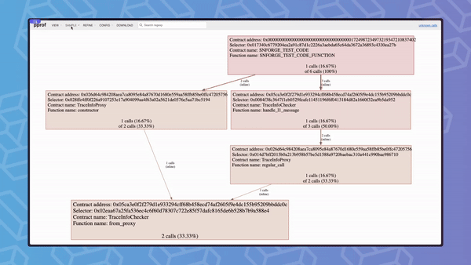

# cairo-profiler

Profiler for Cairo programming language &amp; Starknet.



## Installation

You can install `cairo-profiler` using [asdf](https://asdf-vm.com/guide/getting-started.html)
or the installation script.

### asdf (recommended):

```shell
asdf plugin add cairo-profiler https://github.com/software-mansion/asdf-cairo-profiler
asdf install cairo-profiler latest # Replace 'latest' with a specific version number if needed
```

Please remember to set global/project version to use:

```shell
# in asdf <0.16.0
asdf local cairo-profiler latest
# OR
asdf global cairo-profiler latest

# or in asdf >= 0.16.0
asdf set cairo-profiler latest
# OR
asdf set -u cairo-profiler latest
```

### script:

To install the latest stable version of `cairo-profiler`, run:

```shell
curl -L https://raw.githubusercontent.com/software-mansion/cairo-profiler/main/scripts/install.sh | sh
```

If you want to install a specific a version, run the following command with the requested version:

```shell
curl -L https://raw.githubusercontent.com/software-mansion/cairo-profiler/main/scripts/install.sh | sh -s -- v0.1.0
```

### Installation on Windows

As for now, `cairo-profiler` on Windows needs manual installation, but necessary steps are kept to minimum:

1. [Download the release](https://github.com/software-mansion/cairo-profiler/releases) archive matching your CPU architecture.
2. Extract it to a location where you would like to have `cairo-profiler` installed. A folder named cairo_profiler in your [`%LOCALAPPDATA%\Programs`](https://learn.microsoft.com/en-us/windows/win32/shell/knownfolderid?redirectedfrom=MSDN#FOLDERID_UserProgramFiles) directory will suffice:
```batch
%LOCALAPPDATA%\Programs\cairo_profiler
```
3. Add path to the cairo_profiler\bin directory to your PATH environment variable.
4. Verify installation by running the following command in new terminal session:
```shell
cairo-profiler --version
```

## External tools integration

`cairo-profiler` is a tool-agnostic profiler which means that it accepts input from any tool. Those tools need to generate
trace in the [expected](https://docs.rs/cairo-annotations/0.2.0/cairo_annotations/trace_data/struct.CallTraceV1.html) format.

### Integrated tools

- [x] [Starknet Foundry](https://github.com/foundry-rs/starknet-foundry) - check how to use it with `cairo-profiler` [here](https://foundry-rs.github.io/starknet-foundry/snforge-advanced-features/profiling.html)

## Usage

Usage flow consists of two steps:

- generating the output file
- viewing the generated profile

### Generating output file

To generate the file run `cairo-profiler` with the `<PATH_TO_TRACE_DATA>` argument containing
the path to the json file with the trace to be profiled. You can also specify the path to the output file via `--output-path <OUTPUT_PATH>` -
if not specified, the output file will be saved as `profile.pb.gz`.

#### Example

```shell
cairo-profiler build-profile path/to/trace.json
```
or
```shell
cairo-profiler path/to/trace.json
```

> 📝 **Note**
>
> Trace needs to be in the correct format. See [trace.json](./crates/cairo-profiler/tests/data/call.json) as an example.

### Viewing profile

You can use the `cairo-profiler` to see the results from the generated file. The information will be printed in `top`
view, closely mimicking `pprof` output. There are two ways to view the profile:
- by using `view` subcommand on previously generated profile file
- by adding `--view` flag to `build-profile` subcommand

By default, the top 10 `steps` samples will be shown. This can be changed using `--limit` and `--sample` flags.

#### Examples:

Viewing directly after building the profile:
```shell
cairo-profiler build-profile path/to/trace.json --view
```

Viewing the previously built profile:
```shell
cairo-profiler view path/to/profile.pb.gz
```

Viewing all the available samples in the profile:
```shell
cairo-profiler view path/to/profile.pb.gz --list-samples
```

Viewing the top 2 nodes for "range check builtin" sample:
```shell
cairo-profiler view path/to/profile.pb.gz --sample "range check builtin" --limit 2

Showing nodes accounting for 37 range check builtin, 92.50% of 40 range check builtin total
Showing top 2 nodes out of 14

                   flat |  flat% |   sum% |                    cum |    cum% |
------------------------+--------+--------+------------------------+---------+-----------------------------------------------------------------------
 22 range check builtin | 55.00% | 55.00% | 40 range check builtin | 100.00% | "Contract: SNFORGE_TEST_CODE\nFunction: SNFORGE_TEST_CODE_FUNCTION\n"
 15 range check builtin | 37.50% | 92.50% | 15 range check builtin |  37.50% | "CallContract"
```

Viewing the nodes with everything from crate "core" filtered out:
```shell
cairo-profiler view path/to/profile.pb.gz --hide "^core::*"
```

#### Using pprof

Alternatively to see results from the generated file you can also use `pprof`. To do so, you will need to install:

- [Go](https://go.dev/doc/install)
- [Graphviz](https://www.graphviz.org/download/)
- [pprof](https://github.com/google/pprof?tab=readme-ov-file#building-pprof)

and run:

```shell
go tool pprof -http=":8000" profile.pb.gz
```

This command will start a web server at the specified port that provides an interactive interface.
You can learn more about pprof usage options [here](https://github.com/google/pprof?tab=readme-ov-file#basic-usage).

## Roadmap

`cairo-profiler` is under active development! Expect a lot of new features to appear soon! 🔥

- [ ] Starknet calls profiling:
  - [x] L2 resources - steps, memory holes, builtins, syscalls 
  - [ ] L1 resources - contract updates, L2 -> L1 messages
- [ ] Function level profiling:
  - [x] Steps profiling
  - [ ] Builtins profiling
  - [ ] Memory holes profiling
  - [x] Information about inlined functions
- [ ] Integrating with other tools:
  - [x] Exposing `cairo-profiler` library to allow other tools to integrate
  - [x] Integrating with [`snforge`](https://github.com/foundry-rs/starknet-foundry)
  - [ ] Integrating with `cairo-test` and `cairo-run`

## Development

### Environment setup
You need to install: [Rust](https://www.rust-lang.org/tools/install), [Go](https://go.dev/doc/install), 
[protoc](https://grpc.io/docs/protoc-installation), [pprof](https://github.com/google/pprof?tab=readme-ov-file#building-pprof) and [Graphviz](https://graphviz.org/download). 

### Running the binary

The binary can be run with:

```shell
cargo run <PATH_TO_TRACE_DATA>
```

### Running tests

Tests can be run with:

```shell
cargo test
```

### Formatting and lints

`cairo-profiler` uses [rustfmt](https://github.com/rust-lang/rustfmt) for formatting. You can run the formatter with:

```shell
cargo fmt
```

For linting, it uses [clippy](https://github.com/rust-lang/rust-clippy). You can run it using our defined alias:

```shell
cargo lint
```

### Spelling

`cairo-profiler` uses [typos](https://github.com/marketplace/actions/typos-action) for spelling checks.

You can run the checker with

```shell
typos
```

Some typos can be automatically fixed by running

```shell
typos -w
```
